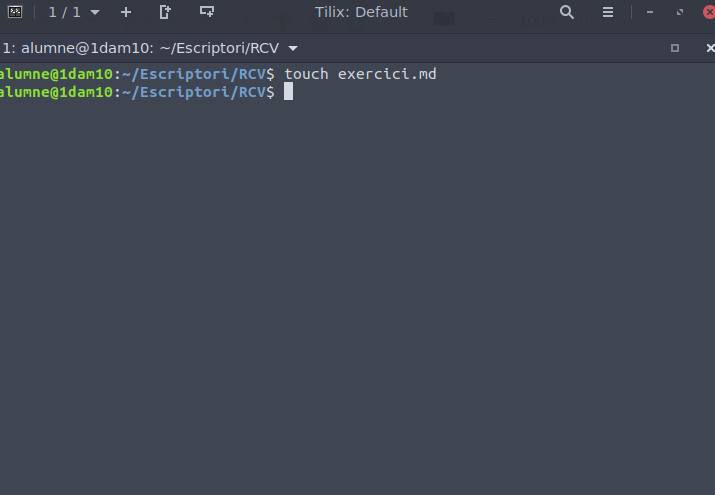
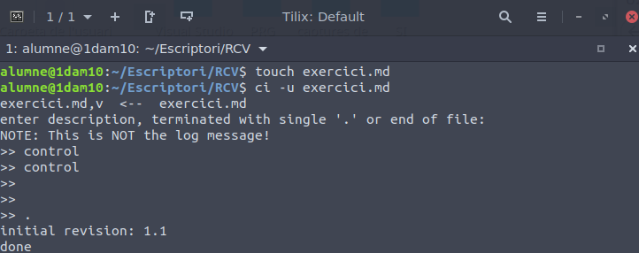
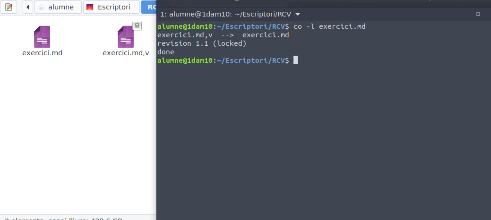
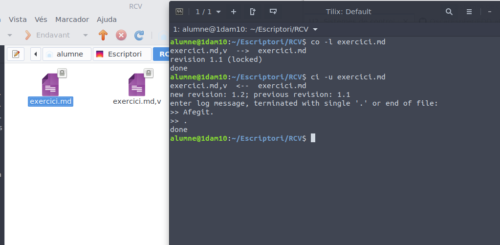
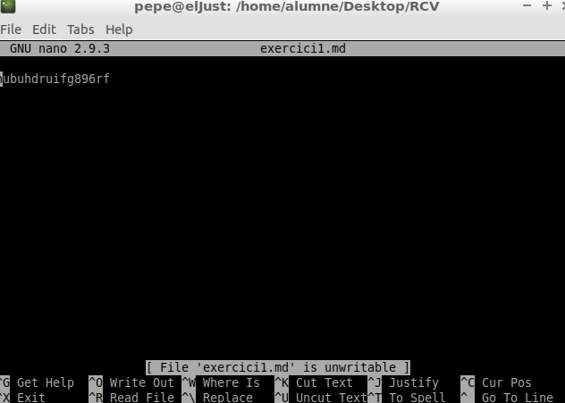
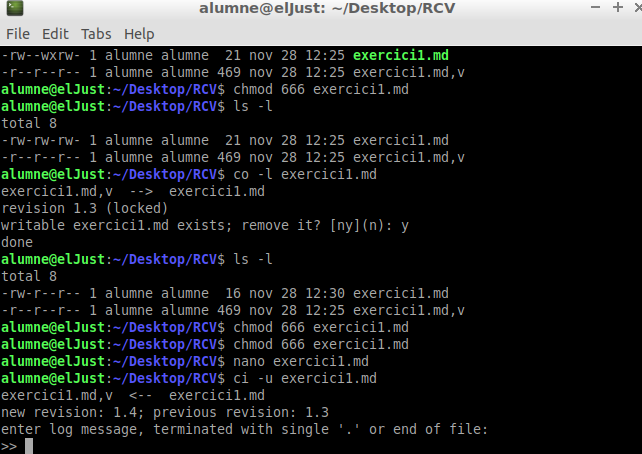
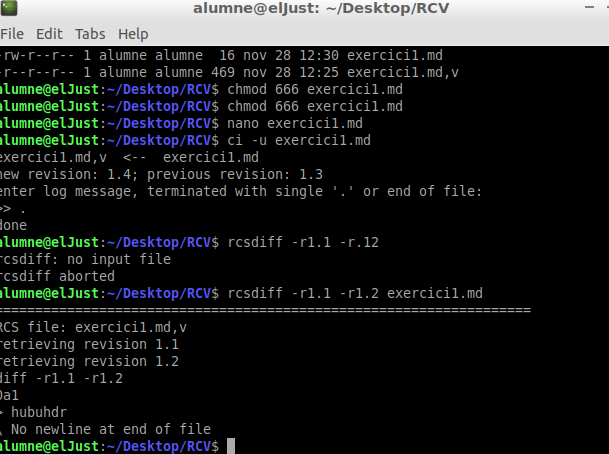

# Exercicis RCS

1.Creeu un fitxer anomenatexercici.md, i afegiu-li algun contingut en format Markdwon.

2.Registreu el fitxer per a que el controle RCS

3.Intenteu modificar el fitxer, per veure si teniu o no permís

4.Feu uncheckoutdel fitxer, ara sí, per afegir canvis.

5.Modifiqueu el fitxer i afegiu-li més contingut. Aquesta serà la versió 1.2

6.Amb un altre usuari, intenteu modificar el fitxer (fent el checkout abans).

9.Si podeu, afegiu més informació al fitxer, ara serà la versió 1.4

10.Com a l’usuari original, visualitzeu les diferències entre les versions, i torneu a la versió 1.2.

