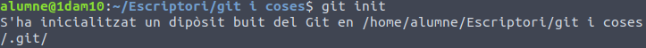
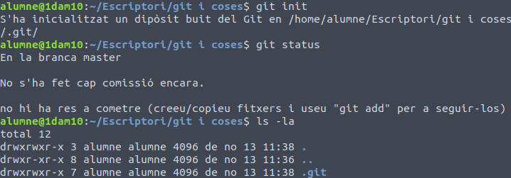
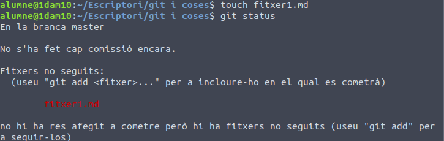
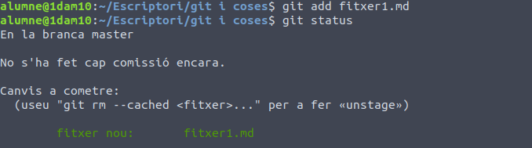
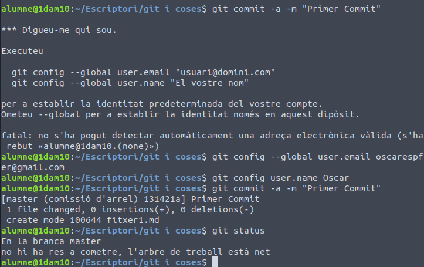
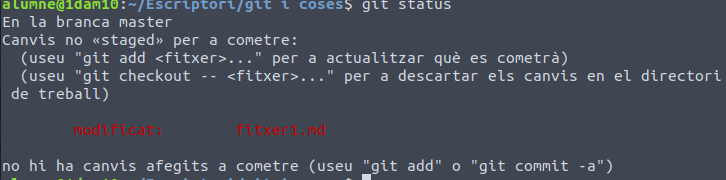
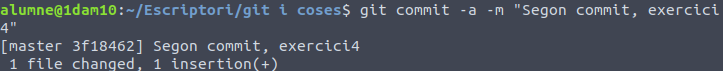

# Exercicis de Git.

Primerament, iniciarem un repositori git

seguidament, comprovarem el estat del git, així com alló que conté.

Crearem un fitxer, i comprovarem el estat

Ara que el fitxer està creat, hem de afegir-lo al seguiment

Fet això farem el primer commit

Com a ultim exercici modificarem un arxiu, afegirem un nou, i farem el 2n commit

