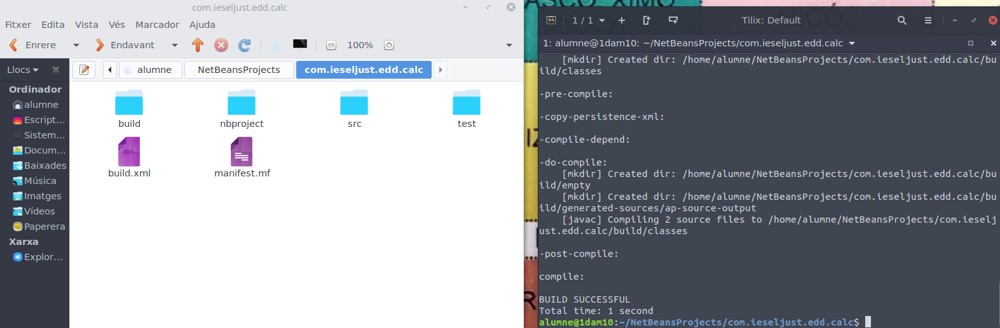
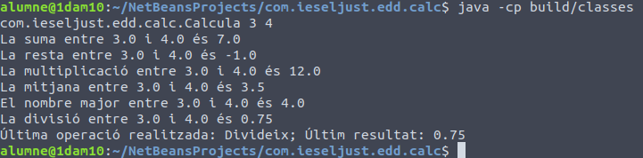

# Ant

Primerament anem a escriure el codi, i actualitzar-lo al que demana la activitat.

Una vegada fet açò, localitzem la carpeta del projecte, i la compilem utilitzant "ant compile"

Comprovem que funciona correctament executant-la amb "java -cp "Direcció" "

