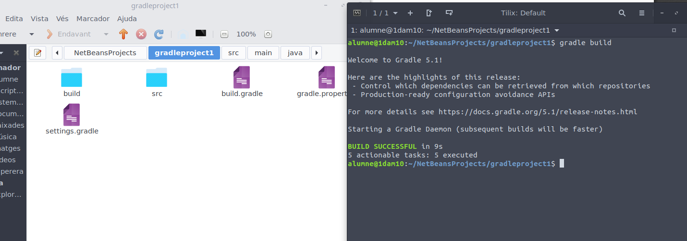

# gradle

Primerament hem de crear l'estructura de carpetes que anem a necessitar, en aquest cas he gastat la ferramenta que ofereix netbeans.

Una vegada fet açò, podem escriure el programa i compilar-lo utilitzant "gradle build"

Una vegada fet açò, ja podem executar l'arxiu utilitzant gradle run --args

