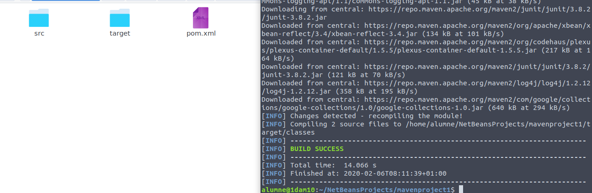
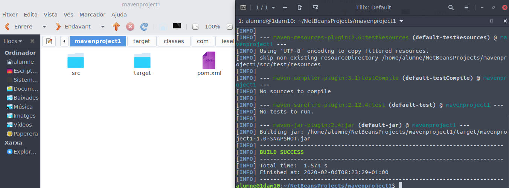

# Maven

Primerament hem de crear l'estructura de carpetes que anem a necessitar, en aquest cas he gastat la ferramenta que ofereix netbeans.

Una vegada fet açò, podem escriure el programa i compilar-lo utilitzant "mvn compile"

Fet açò, podem empaquetar el projecte en un .jar, utilitzant "mvn package", i fet açò podrem ejecutarlo amb java -cp.

