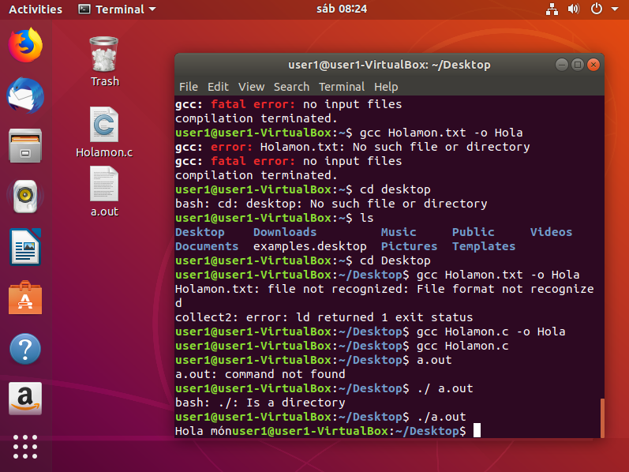
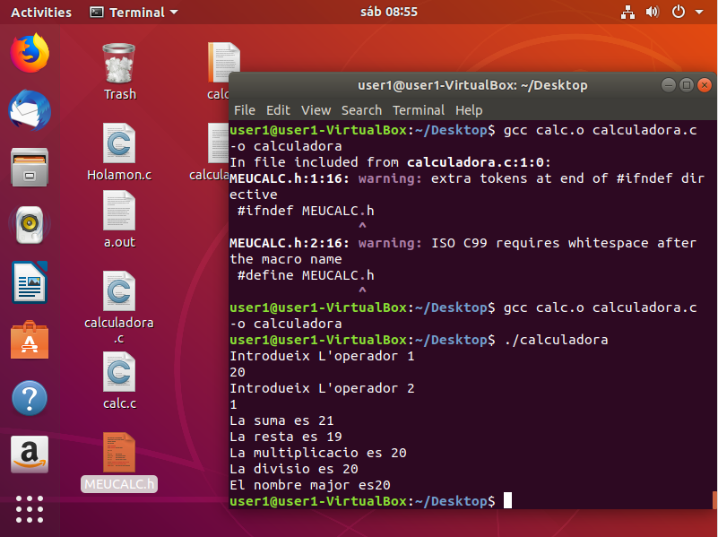

# Subversion Edge

Primerament anem a compilar el programa Hola mon, utilitzant GCC.

Seguidament, comprovem que funciona

Seguidament, creem el fitxer Makefile, i l'executem.

Modifiquem el Makefile, per que aquest borre els .o residuals

Tornem a modifical el Makefile, en este cas per a afegir variables, el tornem a executar per veure si funciona correctament.

Per ultim el tornem a modificar esta vegada per a que amés del anterior, aquest instale el nostre programa, perque puga ser utilitzat desde qualsevol terminal del equip.

