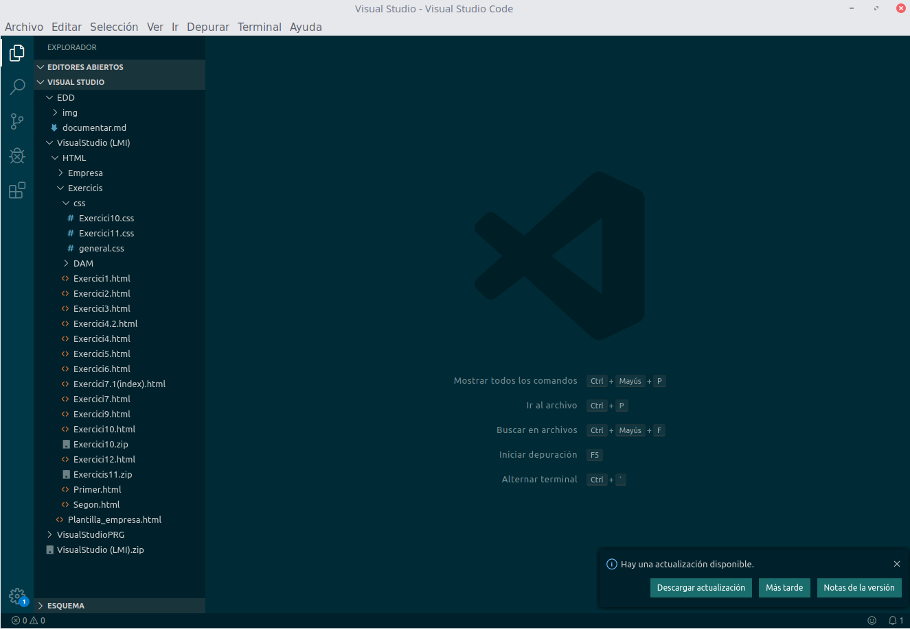
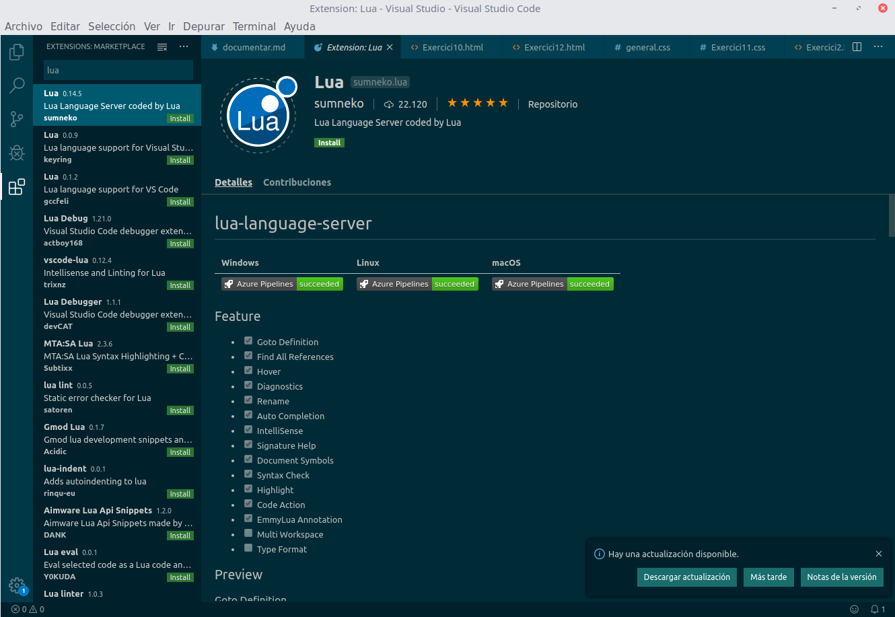

# Instal·lació de extensions a Visual Studio Code

Primerament, obrim el Visual Studio Code i polsem a l'icono de els 4 cuadrats situat a la part esquerra del programa.

Una vegada allí, buscarem el nom de l'extensió que desitgem instal·lar i polsarem instal·lar.

