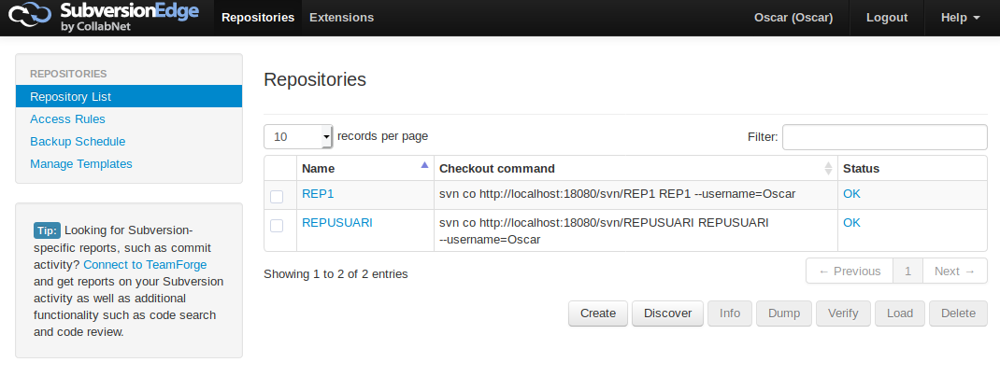
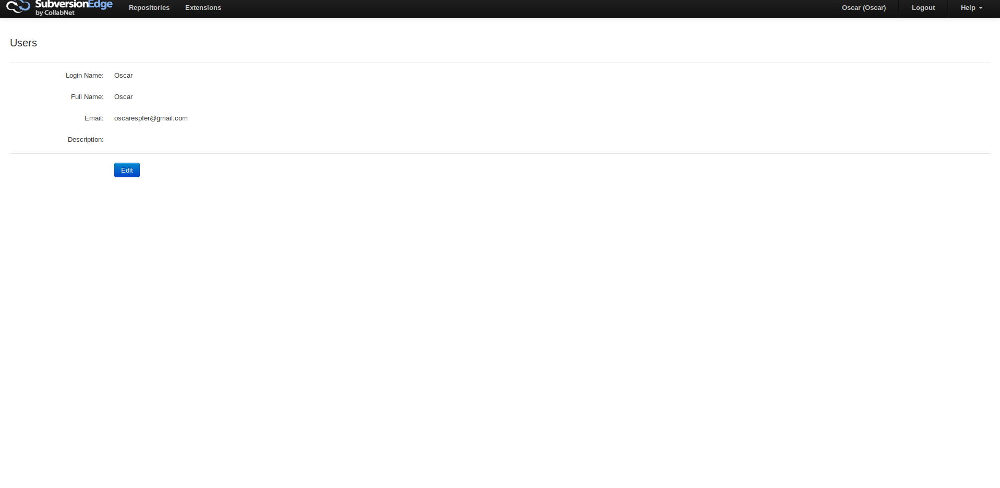

# Subversion Edge

Primerament anem a necessitar e Docker per poder treballar amb subversion, rao per la qual hem de instal·lar-lo

Seguidament, baixarem una imatge de Subversion Edge, i la configurarem.

Per ultim crearem un usuari i un parell de repositoris.

Fet açó, designarem una carpeta per tindre el repositori local de Subversion
